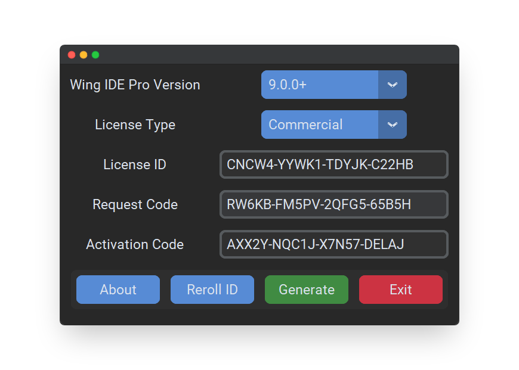

<!-- Hello there -->

<h1 align="center">
  Wing IDE Pro Keygen GUI 🔑
</h1>

<h4 align="center">
  License activation code generator for WingWare's
  <a href="https://wingware.com">
    Wing Python IDE
  </a>
  <br/>
  Supported major versions: 5, 6, 7, 8, and 9
</h4>

<div style="text-align: center;">
    
</div>

## ⚠️ Disclaimer

This project exists solely for _educational and demonstrative_ purposes of how license/key generation software, aka "keygen" software, functions. Usage of this project to bypass the purchase of a genuine license is arguably **illegal and considered theft**, or at the very least highly unethical. Please consider [purchasing a license](https://wingware.com/store/purchase). The developers of Wing IDE have a right to be paid for the product they are selling.

## 🌙 Usage

> Note: This project was developed using Python `3.11.0`. There is zero guarantee that the code will run properly on older versions.

#### Clone the repo (requires [Git](https://git-scm.com/))
```bash
git clone https://github.com/rodriguez-moon/wing-ide-keygen-gui.git
cd wing-ide-keygen-gui
```
#### Install the project dependencies and run the file
```bash
python -m pip install -r requirements.txt
python ./src/main.py
```

